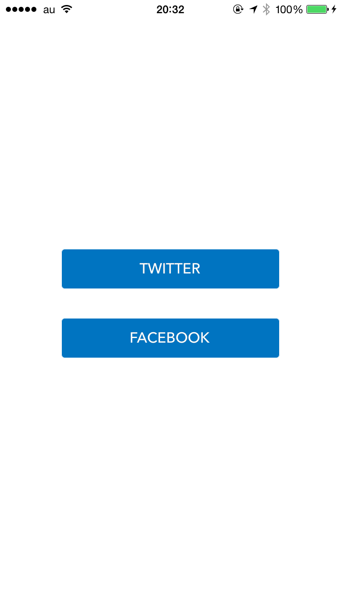
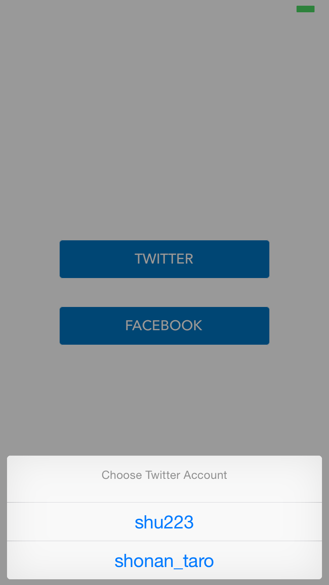

Social API Helpers
======================

**Twitter and Facebook API Helper classes** for iOS using Social.framework. It works on iOS 6 or later.

##How to install

Add to Podfile.

```
pod 'SocialAPIHelpers', :git => 'https://github.com/shu223/SocialAPIHelpers'
```

##EXAMPLES: Authorization



###Request access to Twitter

Just call 1 method.

```
[TTMAccountHelper requestAccessToTwitterAccountsWithHandler:^(NSError *error) {
}];
```


###Request access to Facebook

Create a dictionary for options (permissions) and call the request method.

```
NSDictionary *options = [TTMAccountHelper optionsToReadStreamOnFacebookWithAppId:kFacebookAppId];

[TTMAccountHelper requestAccessToAccountsWithType:ACAccountTypeIdentifierFacebook
                                          options:options
                                          handler:^(NSError *error) {
                                          }];
```


###Multi-account support

```
NSArray *accounts = [TTMAccountHelper twitterAccounts];

if ([accounts count] >= 2) {
 
 [TTMAccountHelper showAccountSelectWithDelegate:self
                                          inView:self.view];
}
```




##EXAMPLES: Access to Twitter API

###Getting user information

####Me

```
[TTMTwitterAPIHelper userInformationForAccount:account
                                       handler:
 ^(id result, NSError *error) {
     
     NSLog(@"result:%@, error:%@", result, error);
 }];
```

####Other users

```
[TTMTwitterAPIHelper userInformationWithScreenName:screenName
                                           account:account
                                           handler:
 ^(id result, NSError *error) {
     
     NSLog(@"result:%@, error:%@", result, error);
 }];
```

###Read Timeline

####Home

```
[TTMTwitterAPIHelper homeTimelineForAccount:account
                                    handler:
 ^(id result, NSError *error) {

     NSLog(@"result:%@, error:%@", result, error);
 }];
```

####User

```
[TTMTwitterAPIHelper userTimelineWithScreenName:@"shu223"
                                        account:account
                                        handler:
 ^(id result, NSError *error) {

     NSLog(@"result:%@, error:%@", result, error);
 }];
```

##EXAMPLES: Access to Facebook API

###News Feed

```
[TTMFacebookAPIHelper newsfeedForAccount:account
                                 handler:
 ^(id result, NSError *error) {
 
     NSLog(@"result:%@, error:%@", result, error);
 }];
```
